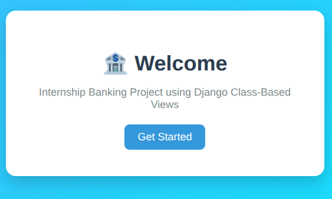
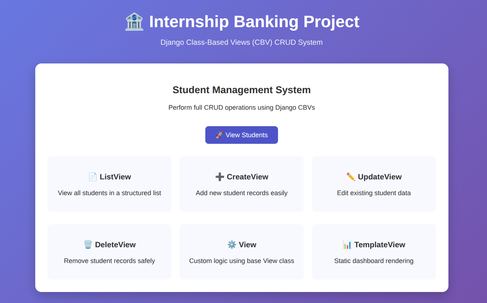
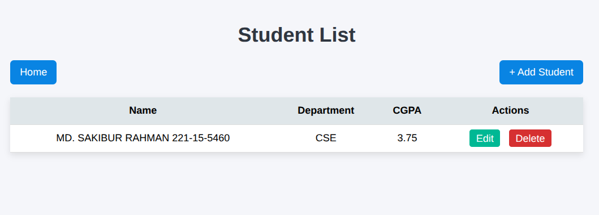
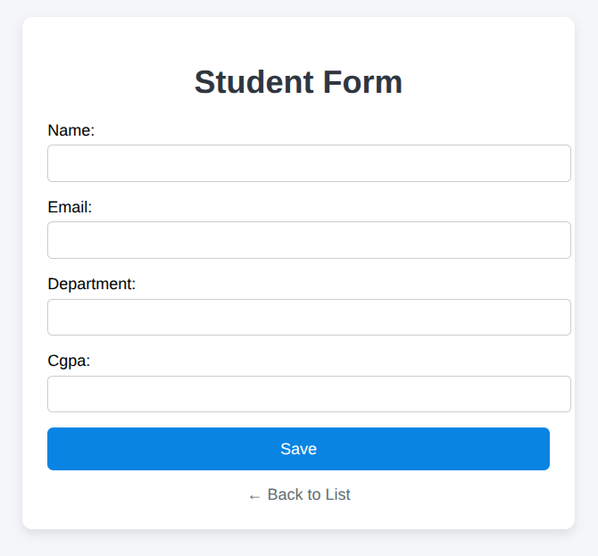
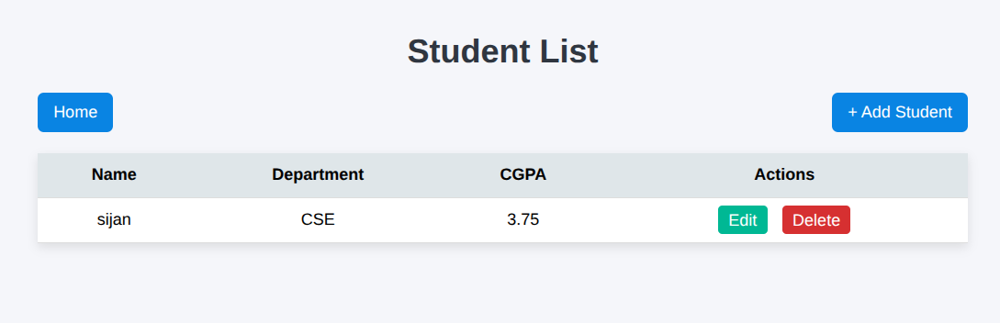
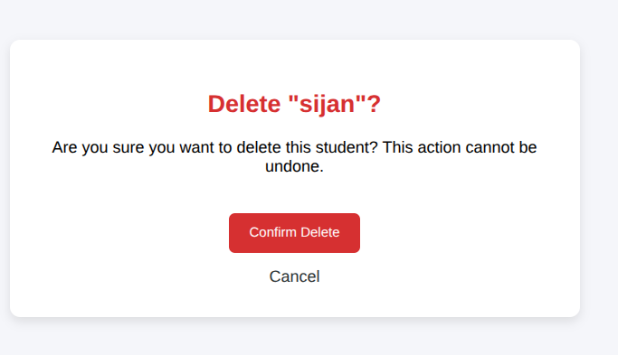
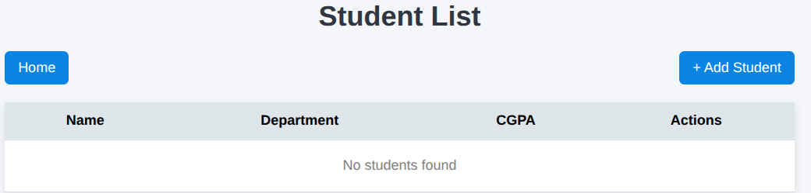

# Task 0 — Django Class-Based Views (CBV) Implementation Guide

## 📌 Overview

This document explains the implementation of Django Class-Based Views (CBVs) using a complete CRUD system for a `Student` model. The goal of this task is to understand different CBVs, their internal behavior, and when to use each one in real-world applications.

I implement the same feature set using:

- `View`
- `TemplateView`
- `ListView`
- `CreateView`
- `UpdateView`
- `DeleteView`

---

# Django Class Based Views Comparison

## View

Use when complete control is needed.

Pros:
- Full flexibility

Cons:
- More code

---

## TemplateView

Use when rendering static pages.

Pros:
- Very simple

Cons:
- No database operations

---

## ListView

Use for displaying model lists.

Pros:
- Automatic querying

Cons:
- Less flexibility

---

## CreateView

Use for creating records.

Pros:
- Automatic form handling

Cons:
- Custom logic can be harder

---

## UpdateView

Use for editing records.

Pros:
- Automatic object retrieval

Cons:
- Limited customization

---

## DeleteView

Use for deleting records.

Pros:
- Built-in confirmation

Cons:
- Less control

# 🧠 Core Concept

Django CBVs reduce boilerplate code by providing reusable logic for common web operations like:

- Rendering pages
- Listing database records
- Creating objects
- Updating objects
- Deleting objects

Instead of writing repetitive function-based views, Django provides structured classes.

---

## 🔵 View (Output)

This view shows a simple HTTP response without any template or database.

📸 Output Screenshot:

---

## 🟢 TemplateView (Output)

This view renders a static dashboard page.

📸 Output Screenshot:

---

## 🟡 ListView (Output)

This view displays all student records from the database.

📸 Output Screenshot:

---

## 🟠 CreateView (Output)

This view is used to create a new student record.

📸 Form Page:

📸 After Submission (Redirect to ListView):

---

## 🔵 UpdateView (Output)

This view updates an existing student record.

📸 After Update:

---

## 🔴 DeleteView (Output)

This view confirms and deletes a student record.

📸 Confirmation Page:

📸 After Deletion:

